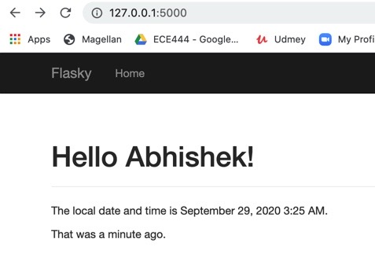

# ECE444-F2020-Lab3

This repo is a clone of
https://github.com/miguelgrinberg/flasky

---
**Activity1:-**

---
**Activity2:-**

---

---

---

---
**Activity3:-**

The main differences between SQL databases and noSQL databases arise from the fact that SQL databases are relational and use structured schemas while noSQL databases are non-relational and use unstructured data. The following are the key differences between the two:

SQL databases <—> noSQL databases:
1. relational <—> non-relational.
2. Structured data, have a predefined schema <—> Unstructured data
3. Vertically scalable <—> horizontally scalable.
4. Table based <—> documents, key-value pairs, graph
5. Better when there are relationships between tables, suited for query intensive environment <—> Better for unstructured data like documents or JSON. Good for hierarchical data.

SQL database examples:
- Oracle, MS-SQL, and Postgres SQL

noSQL database examples:
- MongoDB, Cassandra, Hbase

