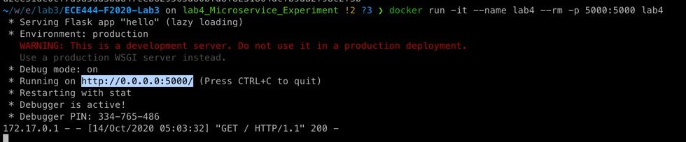
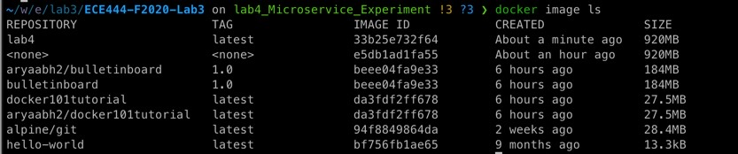
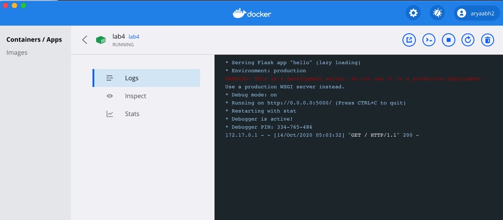
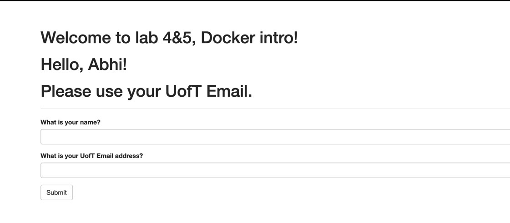

# ECE444-F2020-Lab3 (LAB-4&5 Experiment)

This repo is a clone of
https://github.com/miguelgrinberg/flasky

**Deliverable 1: (1 mark)**
All development has been performed in branch "lab4_Microservice_Experiment" in my Lab3 task GitHub repository 

**Deliverable 2: (6 mark)**
- README.md file (Done)
- To build the system: 
    - `docker build -t lab4:latest .`
- To start the system use either of the following commands (both work): 
    - `docker run -d -p 5000:5000 lab4`
    - `docker run -it --name lab4 --rm -p 5000:5000 lab4`
- Location of Docker files:
    - ./Dockerfile
    - ./requirements.txt
- SCREENSHOTS:

    - 

    - 

    - 

    - 

**Deliverable 3: (3 mark)**

Briefly summarize the differences between Docker and Virtual Machine:

